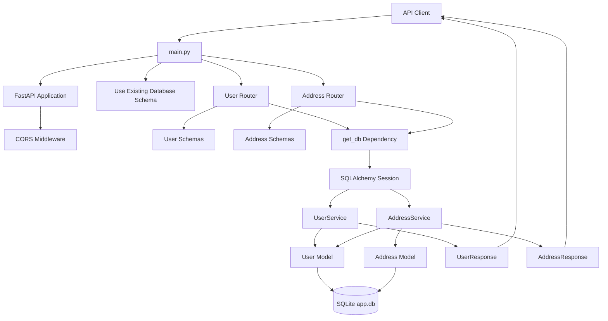
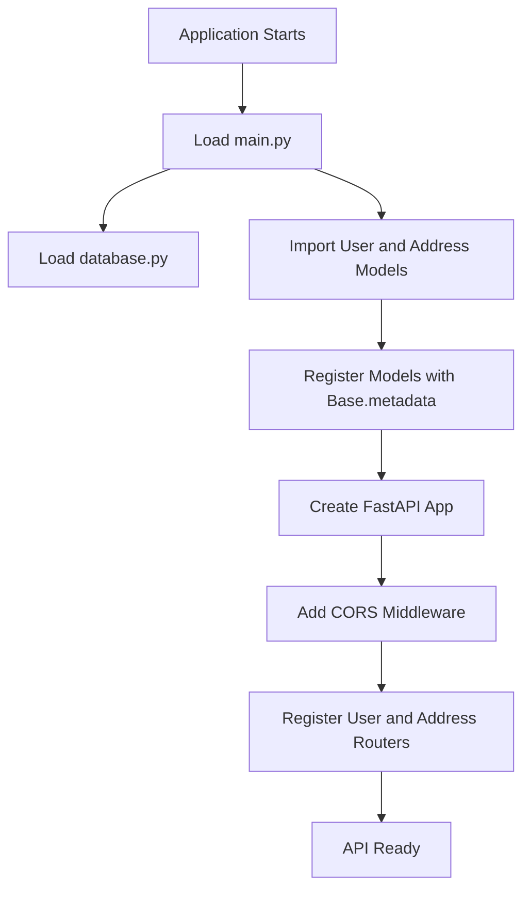
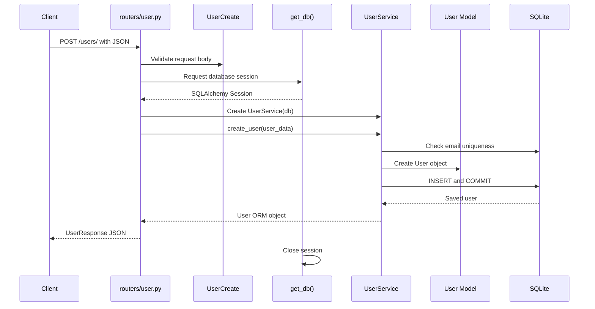
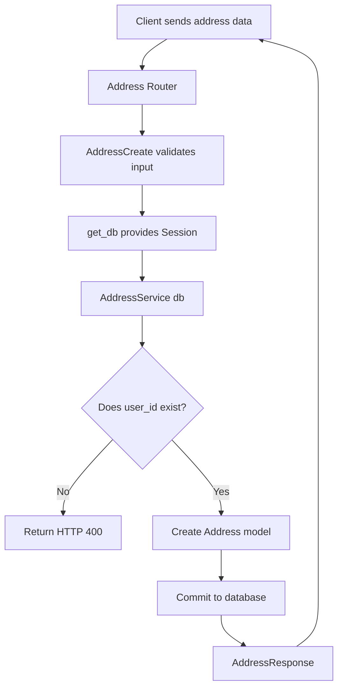
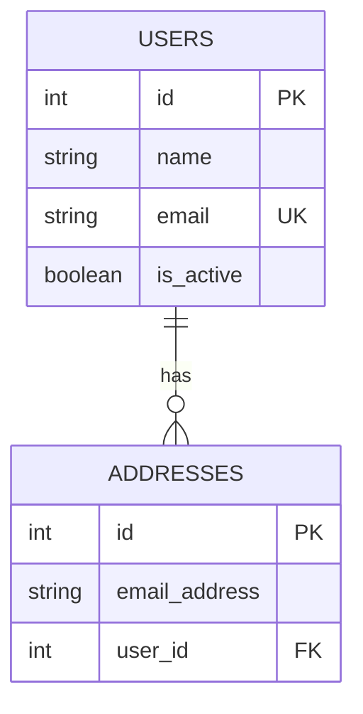

# FastAPI Project Architecture Flow

## Project Structure

```text
awesome-project/
├── main.py
├── database.py
├── pyproject.toml
├── requirements.txt
├── models/
│   ├── user.py
│   └── address.py
├── schemas/
│   ├── user.py
│   └── address.py
├── services/
│   ├── user_service.py
│   └── address_service.py
└── routers/
    ├── user.py
    └── address.py
```

## Complete Application Flow



## Startup Flow



## Request Flow

Every request follows this general path:

```text
Client
  -> FastAPI application
  -> Router
  -> Request schema validation
  -> Database session dependency
  -> Service class
  -> SQLAlchemy model
  -> SQLite database
  -> Response schema
  -> Client
```

## User Request Example

Example request:

```text
POST /users/
```



## Address Request Example

Example request:

```text
POST /addresses/
```



## Layer Responsibilities

### `main.py`

- Creates the FastAPI application.
- Loads the application; database schema changes are managed by Alembic.
- Adds CORS middleware.
- Includes the user and address routers.
- Provides the root endpoint: `GET /`.

### `database.py`

- Creates the SQLite engine.
- Creates the SQLAlchemy session factory.
- Defines the declarative `Base` class.
- Provides `get_db()` for one database session per request.
- Closes the session after the request finishes.

### Routers

Routers handle HTTP-related responsibilities:

#### User routes

```text
GET    /users/
GET    /users/{user_id}
POST   /users/
PUT    /users/{user_id}
DELETE /users/{user_id}
```

#### Address routes

```text
GET    /addresses/
GET    /addresses/{address_id}
POST   /addresses/
DELETE /addresses/{address_id}
```

Routers should translate service errors into HTTP errors such as `404` or `400`.

### Services

Services contain business logic and database operations.

#### `UserService`

- Find one user.
- List users.
- Create a user.
- Check for duplicate email addresses.
- Update a user.
- Delete a user.

#### `AddressService`

- Find one address.
- List addresses.
- Create an address.
- Check that the referenced user exists.
- Delete an address.

The database session is passed through the constructor:

```python
service = UserService(db)
```

The constructor stores the session on the object:

```python
def __init__(self, db: Session):
    self.db = db
```

### Schemas

Schemas validate request data and define response data.

#### User schemas

```text
UserCreate    -> POST /users/ request body
UserUpdate    -> PUT /users/{user_id} request body
UserResponse  -> User response JSON
```

#### Address schemas

```text
AddressCreate   -> POST /addresses/ request body
AddressResponse -> Address response JSON
```

### Models

Models represent database tables.



A single user can have multiple addresses. Every address belongs to one user through `user_id`.

## CRUD Flow

### Create

```text
Request JSON
  -> Create schema validation
  -> Service business rule check
  -> SQLAlchemy model creation
  -> db.add()
  -> db.commit()
  -> db.refresh()
  -> Response schema
```

### Read

```text
Request path or query parameters
  -> Router
  -> Service query
  -> SQLAlchemy model result
  -> Response schema
```

### Update

```text
Request JSON
  -> Update schema validation
  -> Find existing model
  -> Apply changed fields
  -> db.commit()
  -> db.refresh()
  -> Response schema
```

### Delete

```text
Request path parameter
  -> Find existing model
  -> Return 404 if missing
  -> db.delete()
  -> db.commit()
  -> Return 204
```

## Alembic Migration Flow

Database schema changes are managed outside application startup:

```text
Change SQLAlchemy model
  -> Generate Alembic migration
  -> Review migration
  -> Apply migration with alembic upgrade head
  -> Start FastAPI application
```

The migration environment is in `alembic/`, with configuration in `alembic.ini` and revisions in `alembic/versions/`.

## Recommended Development Roadmap

1. Keep routers responsible for HTTP only.
2. Keep business rules inside service classes.
3. Add FastAPI dependencies such as `get_user_service()` and `get_address_service()` so routers do not instantiate services repeatedly.
4. Add Alembic migrations instead of relying on `Base.metadata.create_all()` for production database changes.
5. Add custom service exceptions for duplicate users, missing users, and missing address owners.
6. Add unit tests for service methods.
7. Add API tests for router behavior and HTTP status codes.
8. Add validation for pagination values such as `skip` and `limit`.
9. Move the database URL and CORS settings into environment-based configuration.
10. Add authentication and authorization before exposing protected operations.

## Architecture Summary

```text
HTTP Layer        -> routers/
Validation Layer  -> schemas/
Business Layer    -> services/
Data Layer        -> models/ + database.py
Database          -> SQLite app.db
```
